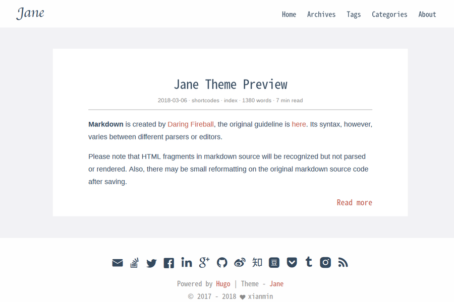

## 框架选型

这个网站为纯静态站点，不涉及数据库及用户的信息存储，所以采用静态站点生成器来实现。而目前我正在学习`golang`语言，所以也就顺理成章地选择了`hugo`。

```shell
$ hugo new site champ.design
```

## 关于主题

网站最开始采用的 [jane](https://themes.gohugo.io/themes/hugo-theme-jane/) 主题，看起来是下面这样子：



不过一直都感觉不太符合我的审美。
直到有一天，我看到了[这个网站](https://lifeni.life/)的设计，给了我一种特别的感觉。或许这就是我想要的效果吧，简洁而又大方，没有那么花里胡哨：


因此，这个网站的主题从此就基于它进行二次开发了。

```shell
$ hugo new theme basic
```

## 关于自动发布

采用 Github Actions 的自动发布机制。

> 关于采用`Github Actions`自动发布`hugo`站点，可以参考 [这篇文章](https://medium.com/zendesk-engineering/a-github-actions-workflow-to-generate-publish-your-hugo-website-f36375e56cf7) 和 [这篇文章](https://lifeni.life/article/deploy-with-github-actions)

在项目根目录下添加`.github/workflows/deploy.yml`文件(文件名随意，但必须放在`.github/workflows`目录下面)，内容如下：
```yaml
# Workflow to build and deploy site to Github Pages using Hugo

name: Build and Deploy Blog site

on:
  push:
    branches: [ master ]

jobs:
  build-and-deploy:
    
    runs-on: ubuntu-latest

    steps:

      # Step 1 - Checks-out your repository under $GITHUB_WORKSPACE
      - name: Checkout
        uses: actions/checkout@v2
        with:
          submodules: true  # Fetch Hugo themes
          fetch-depth: 0    # Fetch all history for .GitInfo and .Lastmod

      # Step 2 - Sets up the latest version of Hugo
      - name: Setup Hugo
        uses: peaceiris/actions-hugo@v2
        with:
          hugo-version: 'latest'

      # Step 3 - Clean and don't fail
      - name: Clean public directory
        run: rm -rf public

      # Step 4 - Builds the site using the latest version of Hugo
      # Also specifies the theme we want to use
      - name: Build
        run: hugo --theme=basic

      # Step 5 - Create name file
      - name: Create cname file
        run: echo 'blog.champ.design' > public/CNAME

      # Step 6 - Push our generated site to our gh-pages branch
      - name: Deploy
        uses: JamesIves/github-pages-deploy-action@3.7.1
        with:
          ACCESS_TOKEN: ${{ secrets.GITHUB_TOKEN }}
          BRANCH: gh-pages
          FOLDER: public
          CLEAN: true
```

## 后续对网站的完善

- 优化页面样式及交互
- 集成现代前端开发工具链
- 集成 `tools` 项目，`tools`项目采用`sveltejs`开发
- 开发实验室功能，功能待定
