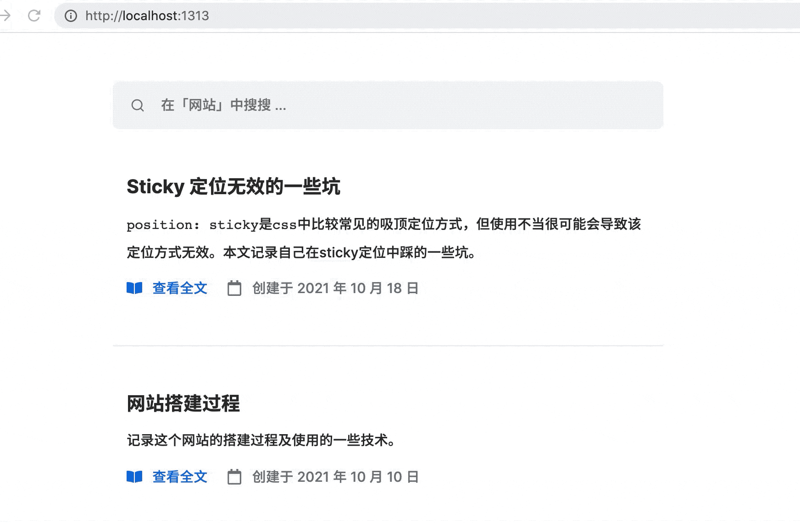
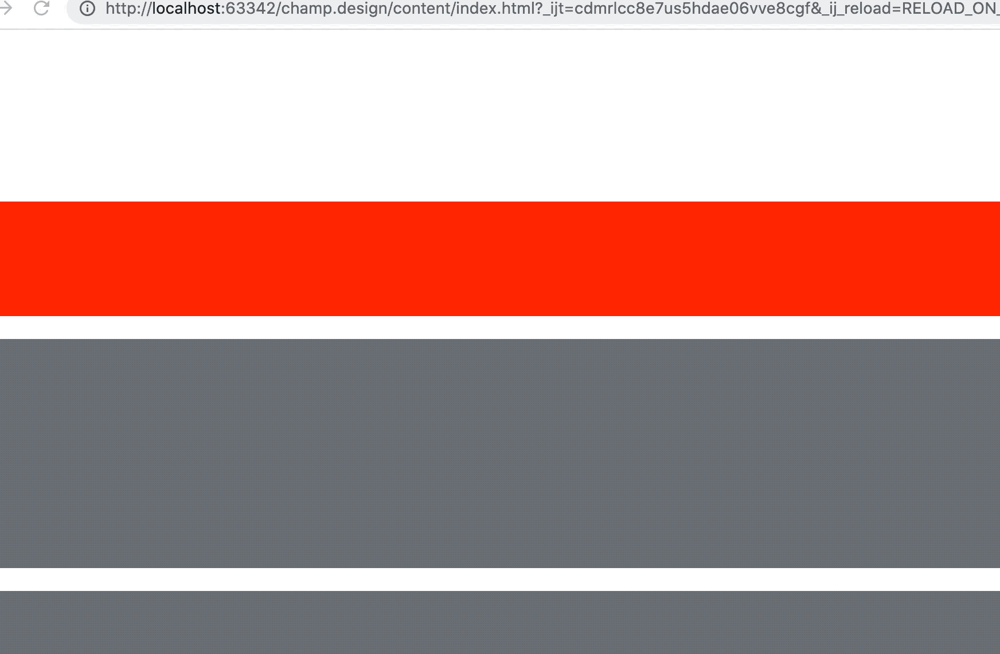
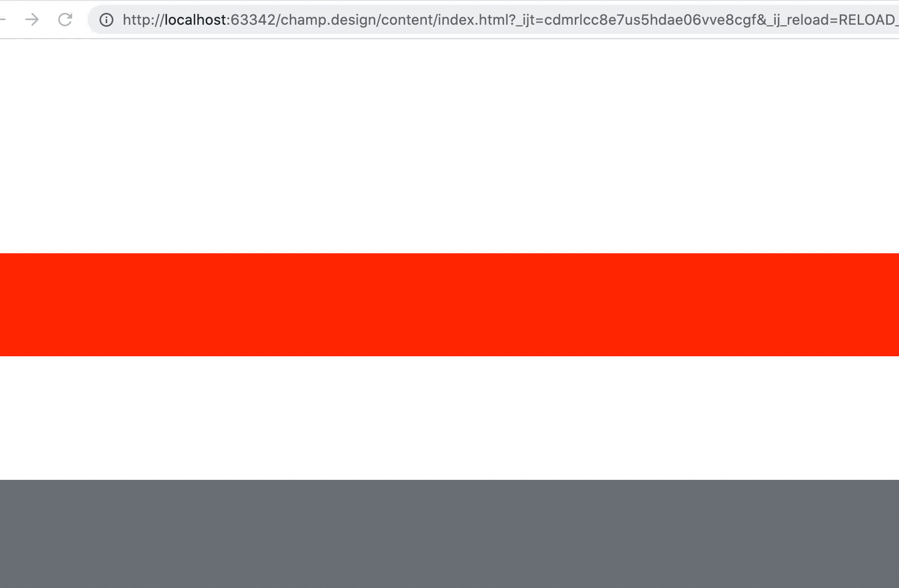

## 场景

在开发这个网站时，我想让顶部的导航栏/搜索栏在滚动时固定在屏幕顶部，这样会更方便用户的操作。期望的效果如下：




## 初步实现的代码 (无效代码:worried:)

### HTML
```html {hl_lines=[4]}
<body>
<div class="container">
    <div class="header">
        <div class="wrapper">需要定位的元素</div>
    </div>
    <div class="content">
        <div class="box"></div>
        <div class="box"></div>
        <div class="box"></div>
        <div class="box"></div>
        <div class="box"></div>
        <div class="box"></div>
        <div class="box"></div>
    </div>
</div>
</body>
```

### CSS
```css {hl_lines=["7-8"]}
.header {
    padding-top: 200px;
}
.wrapper {
    height: 100px;
    background-color: red;
    position: sticky;
    top: 0;
}
.box {
    height: 200px;
    background-color: #6a737d;
    margin: 20px 0;
}
```

正如高亮部分的代码那样，我设置了`.wrapper`元素的`sticky`相关属性后并没有什么效果。




## 求助 Google :blush:

搜了一圈，网上关于sticky无效的几个原因大概如下：

- 必须指定`top/bottom/left/right`这几个属性之一
- 父容器的高度要大于`sticky`元素的高度
- 任意父节点的`overflow`属性必须都是`visible`

在我们这个例子里，要定位的元素是`.wrapper`，父容器是`.header`。我们没有给`.header`显式设置高度，因此它的高度是由内容撑开的，也就是说，父容器
`.header`的高度**等于**子元素`.wrapper`的高度，不满足第2点，因此`sticky`定位无效。

但是这里我们又不能通过设置`.header`的高度来实现，而是要基于`.container`作为容器来设置`sticky`，要不然就会出现下面这种奇怪的行为：



`.wrapper`元素虽然会吸顶，但是当滚动距离大于`.header`的高度后，会被后面的元素顶上去，也不是我们想要的。


## 变通办法

暂时没有找到比较好的解决方法，我们只能把`.header`元素设置为`sticky`定位，然后调整`top`值来达到我们想要的效果。

相关代码如下：
```css {hl_lines=["3-4"]}
.header {
    padding-top: 200px;
    position: sticky;
    top: -200px;
}
.wrapper {
    height: 100px;
    background-color: red;
}
.box {
    height: 200px;
    background-color: #6a737d;
    margin: 20px 0;
}
```

## 总结

要想实现元素吸顶效果，必须设置滚动容器内的直接子元素为`sticky`定位，不能是**后代**子元素。


## 参考

- https://www.designcise.com/web/tutorial/how-to-fix-issues-with-css-position-sticky-not-working#checking-if-a-parent-element-is-a-flexbox
